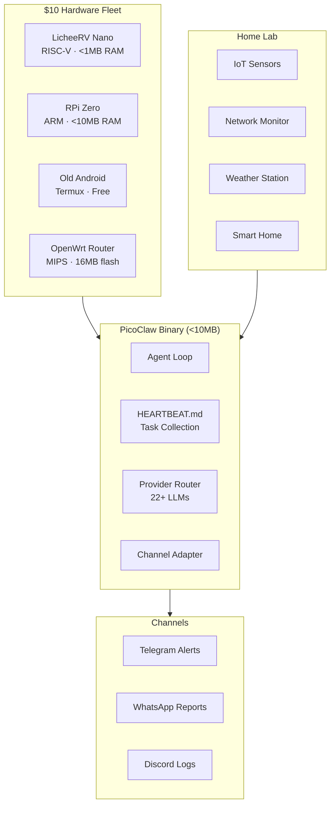

# 🦐 AI-Agent-PicoClaw

<p align="center">
  
</p>

<p align="center">
  <a href="https://github.com/sipeed/picoclaw"></a>
  
  <a href="LICENSE"></a>
  <a href="https://ai-agent-picoclaw.vercel.app"></a>
  
</p>

> **AI on a $10 board.** My edge computing agent lab.

🌐 **[Live Website](https://ai-agent-picoclaw.vercel.app)** · 📖 **[Docs](https://picoclaw.io)** · 🚀 **[Quick Start](#quick-start)**

---

## 🦐 Overview
**PicoClaw** is the edge computing champion of the ecosystem. Written in high-performance Go, it's designed to run on ultra-low-power hardware like RISC-V boards and Raspberry Pi Zeros. It transforms $10 hardware into a 24/7 monitoring and automation hub.

### 💓 The Heartbeat System
PicoClaw uses **Markdown-driven tasks** (`HEARTBEAT.md`) to define its behavior. No complex APIs needed—just edit a text file to change your agent's routine.

---

## 🏗️ Architecture



---

## 🛠️ Edge Skills
Lightweight tasks for limited hardware.

| Skill | Description | Status |
|-------|-------------|--------|
| `network-guardian` | Scans for unauthorized devices and bandwidth anomalies. | 🛡️ New |
| `iot-monitor` | Monitors IoT devices: uptime, resource usage, temp pings. | ✅ Active |
| `home-automation` | Controls smart routines and scheduled security locks. | ✅ Active |
| `resource-optimizer` | Memory + CPU tuner for low-power devices. | ✅ Active |
| `weather-reporter` | Fetches local weather, generates daily briefings. | ✅ Active |

---

## 📄 Heartbeat Definitions
Simple Markdown files that control your edge agent.

| Heartbeat | Interval | Channel |
|-----------|---------|---------|
| `system-diagnostic.md` | 15-min health check for ultra-low RAM boards. | Telegram |
| `security-patrol.md` | Hourly network-level anomaly detection. | Telegram |
| `morning-briefing.md` | 9 AM daily WhatsApp report of home lab health. | WhatsApp |
| `home-server.md` | 30 min checks for servers, disk, and temps. | Telegram |

---

## 📱 Use Cases
How I use PicoClaw daily:

### 1. Recycled Phone Agent
Turned an old Android phone into a 24/7 AI assistant via Termux:
- Free hardware (recycled) → always-on assistant.

### 2. Router AI
Deployed PicoClaw on an OpenWrt router:
- Network-level monitoring and threat detection.

### 3. Home Lab
Raspberry Pi Zero cluster running PicoClaw for home monitoring.

---

## 📂 Repository Structure

```text
AI-Agent-PicoClaw/
├── hardware/                   # Hardware setup guides + photos
│   ├── lichee-rv-nano/
│   ├── raspberry-pi-zero/
│   ├── old-android-phone/
│   └── router-deploy/
├── assets/                    # Project visuals & banners
├── docs/                      # Hardware guides
│   └── hardware/esp32-setup.md# Specialized MCU setup
├── heartbeats/                # Markdown task definitions
│   ├── system-diagnostic.md   # Health monitoring
│   ├── security-patrol.md     # Anomaly detection
│   ├── morning-briefing.md
│   └── home-server.md
├── skills/                    # Lightweight Go skills
│   ├── network-guardian/      # Security logic
│   ├── iot-monitor/
│   ├── home-automation/
│   ├── weather-reporter/
│   └── resource-optimizer/    # RAM management
├── workflows/
│   ├── home-lab-monitor.md
│   ├── heartbeat-tasks.md
│   ├── cross-compile-pipeline.md
│   └── security-patrol.md
├── use-cases/                 # Real-world deployments
│   ├── recycled-phone-agent/
│   ├── router-ai/
│   └── home-lab/              # IoT monitoring examples
├── website/                   # Next.js Site
└── assets/                    # Assets
```

---

## ⚡ Quick Start

```bash
# Pre-built binaries (recommended)
curl -fsSL https://picoclaw.io/install.sh | sh

# From source
git clone https://github.com/sipeed/picoclaw.git
cd picoclaw
go build -o picoclaw ./cmd/picoclaw

# Run
./picoclaw --config config/config.yaml
```

---

## 🗺️ Roadmap

- [x] LicheeRV Nano deployment
- [x] HEARTBEAT.md task system
- [x] Cross-compilation for all targets
- [x] Home automation integration
- [ ] Web UI dashboard (local network)
- [ ] OTA binary updates
- [ ] PicoClaw ↔ ZeroClaw migration guide
- [ ] Matter/Thread IoT protocol support

---

## 🦀 Part of the Claw Ecosystem
| Repo | Focus |
|------|-------|
| [AI-Agent-OpenClaw](https://github.com/mk-knight23/AI-Agent-OpenClaw) | 🦞 Full-stack Hub |
| [AI-Agent-Nanobot](https://github.com/mk-knight23/AI-Agent-Nanobot) | 🐈 Lightweight Lab |
| [AI-Agent-ZeroClaw](https://github.com/mk-knight23/AI-Agent-ZeroClaw) | 🦀 Rust Runtime |
| [AI-Agent-PicoClaw](https://github.com/mk-knight23/AI-Agent-PicoClaw) | 🦐 Edge/IoT · **← You are here** |
| [AI-Agent-NanoClaw](https://github.com/mk-knight23/AI-Agent-NanoClaw) | 🐚 Swarm Agent |

*Part of the Claw Ecosystem by [mk-knight23](https://github.com/mk-knight23)*

---

## ⚖️ License
MIT © [mk-knight23](https://github.com/mk-knight23)
